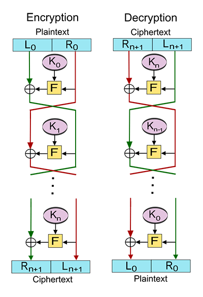

# feistel


This is a Golang library implementing the Feistel cipher for Format-Preserving Encryption (FPE).

### Motivation

The main objective of this library is not to provide a secure encryption scheme but rather a safe obfuscation tool.


### Formal description

This library operates on the concept of the Feistel cipher described in [Wikipedia](https://en.wikipedia.org/wiki/Feistel_cipher) as:
> A Feistel network is subdivided into several rounds or steps. In its balanced version, the network processes the data in two parts of identical size. On each round, the two blocks are exchanged, then one of the blocks is combined with a transformed version of the other block.
> Half of the data is encoded with the key, then the result of this operation is added using an XOR operation to the other half of the data.
> Then in the next round, we reverse: it is the turn of the last half to be encrypted and then to be xored to the first half, except that we use the data previously encrypted.
> The diagram below shows the data flow (the ${\oplus}$ represents the XOR operation). Each round uses an intermediate key, usually taken from the main key via a generation called key schedule. The operations performed during encryption with these intermediate keys are specific to each algorithm.



The algorithmic description (provided by Wikipedia) of the encryption is as follows:
* Let $n+1$ be the number of steps, $K_{0},K_{1},...,K_{n}$ the keys associated with each step and $F:\Omega\times\mathcal{K}\mapsto\Omega$ a function of the $(words{\times}keys)$ space to the $words$ space.
* For each step $i{\in}[0;n]$, note the encrypted word in step $i,m_{i}=L_{i}||R_{i}$:
  * $L_{i+1}=R_{i}$
  * $R_{i+1}=L_{i}{\oplus}F(L_{i},K_{i})$
* $m_{0}=L_{0}||R_{0}$ is the unciphered text, $m_{n+1}=L_{n+1}||R_{n+1}$ is the ciphered word. 

There is no restriction on the $F$ function other than the XOR operation must be possible. For simplicity, we will choose  of the same size as $R_1$ and the function $F$ shall transform a word of length $k$ into a word of length $k$ (and this for all $k$).


### Usage

```
go get github.com/cyrildever/feistel
```

To get an obfuscated string from a source data using an automatic key generation from SHA-256 hashing function at each round, first instantiate a `Cipher` object, passing it a base key and a number of rounds.
Then, use the `Encrypt()` method with the source data as argument. The result will be a byte array.
To ensure maximum security, I recommend you use a 256-bit key or longer and a minimum of 10 rounds.

The decryption process uses the obfuscated byte array and pass it to the `Decrypt()` method of the `Cipher`.

```golang
import "github.com/cyrildever/feistel"

source := "my-source-data"

// Encrypt
cipher := feistel.NewCipher("some-32-byte-long-key-to-be-safe", 10)
obfuscated, err := cipher.Encrypt(source)

// Decrypt
deciphered, err := cipher.Decrypt(obfuscated)

assert.Equal(t, deciphered, source)
```
_NB: This is the exact replica of my Typescript implementation (see below)._

You may also use your own set of keys through a `CustomCipher` instance, eg.
```golang
keys := []string{
  "1234567890abcdef1234567890abcdef1234567890abcdef1234567890abcdef",
  "9876543210fedcba9876543210fedcba9876543210fedcba9876543210fedcba",
  "abcdef0123456789abcdef0123456789abcdef0123456789abcdef0123456789",
}
cipher = feistel.NewCustomCipher(keys)
```
In that case, the number of rounds depends on the number of provided keys.

Finally, you might want to use the latest cipher, providing true format-preserving encryption for strings:
```golang
import "github.com/cyrildever/feistel/common/utils/hash"

cipher = feistel.NewFPECipher(hash.SHA_256, "some-32-byte-long-key-to-be-safe", 128)

obfuscated, err := cipher.EncryptString(source)

str := obfuscated.String()
assert.Equal(t, len([]rune(str)), len(source)) // The source and the obfuscated result have the same number of characters

ascii := obfuscated.String(true)
assert.Equal(t, len(ascii), len(source)) // You must use the `true` argument to the String() method to be sure of that equality in Go (see below)

assert.DeepEqual(t, len(obfuscated.Bytes()), len(source))
```

As stated in the example above, the result of the cipher's `Encrypt()` method is a `Base256Readable` object.
The `String()` method of the latter uses a special 256 charset (see [here](common/utils/base256/readable.go)) which may result in the use of characters that are more than one-byte encoded, thus resulting in an unequality in the results when simply using the `len()` function.
But the underlying byte slice is of correct length, as well as the number of runes, ie. the number of characters to display.

So, for example, you should always use the `Bytes()` method of the result to write bytes directly to your files, instead of the `String()` method which should only be used when displaying (to a screen, to stdout, ...) or use `String(true)` with the risk of having to print unreadable characters if the underlying bytes don't have values within the 33 to 126 range.

Regarding the equality, keep in mind that this is due to the fact that the `len()` function in Go doesn't actually count the number of characters of a string but the length of its underlying byte slice. If the string uses characters that is multiple-byte encoded, then the `len()` function won't return the correct number of actual characters.

**IMPORTANT:** Due to the way the Feistel cipher operates, a word formed of a single character encoded on a single-byte (like `a` for example) is not modified when using the `Encrypt()` or `EncryptString()` methods.


### Other implementations

For those interested, I also made two other implementations of these ciphers:
* In [Typescript](https://github.com/cyrildever/feistel-cipher) for the browser;
* In [Scala](https://github.com/cyrildever/feistel-jar) for the JVM;
* In [Python](https://github.com/cyrildever/feistel-py).

I also created a special library for redacting classified documents using the new FPE cipher. Feel free to [contact me](mailto:cdever@edgewhere.fr) about it.


### Specific development

I mainly use this library to manipulate text files, ie. strings. But, because the "Format" word in the FPE acronym could have different meanings, I've implemented an extra feature for the `FPECipher`: the possibility to preserve the _visible_ format when the input is a number, ie. if you use a 9-digit number, you could get a 9-digit number from the `EncryptNumber()` method (see below for padding options and restrictions to numbers lower than `256`).

```golang
source := 123456789 // 9 digits
cipher := feistel.NewFPECipher(hash.SHA_256, "some-32-byte-long-key-to-be-safe", 128)

obfuscated, _ := cipher.EncryptNumber(uint64(source))
assert.Equal(t, obfuscated.Uint64(), uint64(22780178))
assert.Equal(t, obfuscated.ToNumber(), "22780178") // Only 8 digits

assert.Equal(t, obfuscated.ToNumber(9), "022780178") // To print 9 digits like the source

deobfuscated, _ := cipher.DecryptNumber(obfuscated)
assert.Equal(t, deobfuscated, uint64(source))
```

As you can see, it means that the returned `Readable` type embeds two new methods to retrieve such results:
- The `Uint64()` method which returns the integer value (the eventual sign is left to its own devices);
- The `ToNumber()` method which returns its stringified version, eventually zero-padded to match the minimum length passed as argument (this could be useful to preserve for sure the number of digits to print, as the encryption through the Feistel cipher may result in a smaller number than the original).

_NB: You might want to use the [`NumberToReadable()`](common/utils/base256/readable.go) function when using the ciphered number for decryption._

**IMPORTANT:** Due to the way the Feistel cipher operates, numbers below 256 (ie. only one-byte long) can't preserve the length when using the `EncryptNumber()` method. If length matters, consider using `EncryptString()` instead.

Should you want to use a number with value higher than the accepted max `uint64` value by Golang (`18446744073709551615`) or a floating number, you probably want to use splitting strategies. For example, split it in two numbers that respect the maximum boundaries of a large integer or use both parts (integer and decimal) of the float but not the decimal point itself and rebuild the number afterwards.


### White papers

I wrote two white papers to finally make it a fully FPE scheme:
* the [original one](documentation/src/latex/feistel_whitepaper.pdf) which provided an "almost" format-preserving encryption;
* the [lastest one](documentation/src/latex/fpe_whitepaper.pdf) which elaborates on this first one to push the algorithm towards true format-preserving encryption for strings.


### License

This module is distributed under a MIT license. \
See the [LICENSE](LICENSE) file.


<hr />
&copy; 2019-2024 Cyril Dever. All rights reserved.